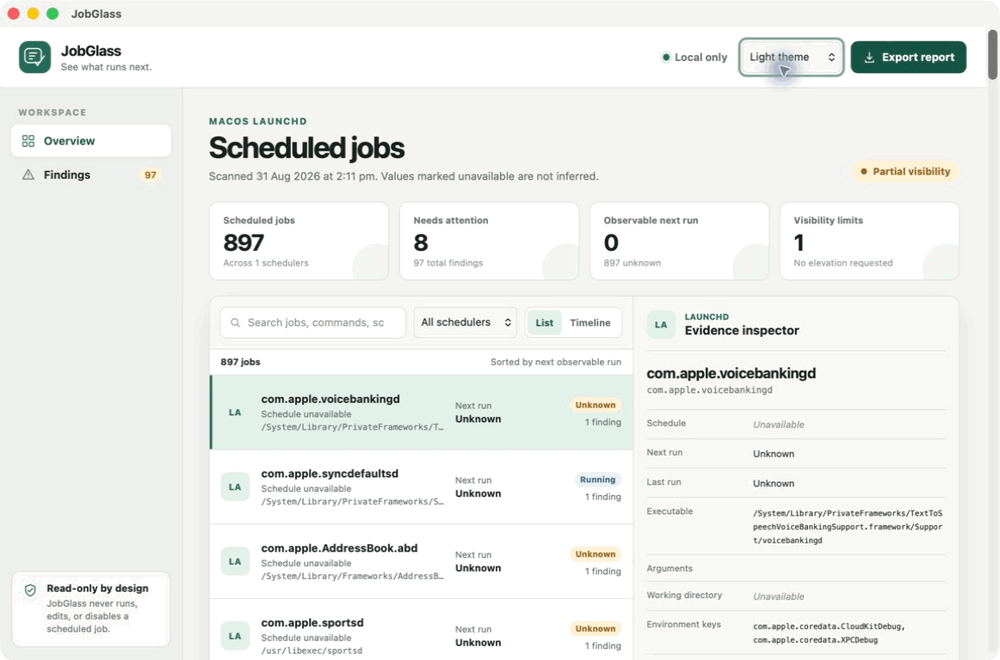
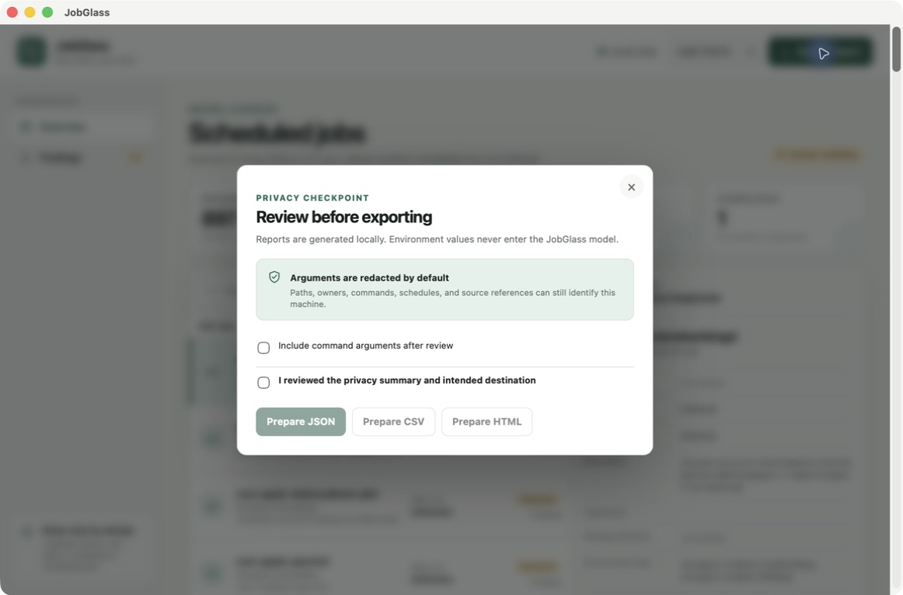

# JobGlass

> **See what runs next.**

[](https://github.com/DrewMauldin/jobglass/actions/workflows/ci.yml)
[](https://github.com/DrewMauldin/jobglass/releases/latest)
[](LICENSE)

JobGlass is a free, local-first desktop inspector for native scheduled jobs. It brings launchd, cron, systemd timers, and Windows Task Scheduler into one searchable evidence view—without accounts, telemetry, cloud services, privilege elevation, or scheduler mutations.



## What it does

- Normalises native job definitions while preserving their source and unavailable fields.
- Shows search, scheduler filters, list and timeline views, detailed evidence, and deterministic findings.
- Flags duplicate identifiers or commands, likely overlaps, missing paths, invalid working directories, stale or disabled jobs, environment-key differences, malformed definitions, and visibility limits.
- Exports deterministic JSON, CSV, or self-contained HTML after an explicit privacy review.
- Redacts command arguments by default and never places environment values in the data model.

JobGlass is intentionally an inspector, not a scheduler. It cannot create, edit, delete, enable, disable, run, stop, or repair a job.

## Install

Download the package for your platform from the [latest GitHub release](https://github.com/DrewMauldin/jobglass/releases/latest), then verify it against `SHA256SUMS` before opening it.

The v0.1.0 community packages are **unsigned**. macOS Gatekeeper and Windows SmartScreen may warn or block them. Read the platform-specific [installation guide](docs/install.md) before bypassing a warning, and do not treat an unsigned package as notarised or publisher-verified.

To build from source instead:

```bash
git clone https://github.com/DrewMauldin/jobglass.git
cd jobglass
npm ci
npm run tauri:build
```

See [development](docs/development.md) for the required Node, npm, Rust, and operating-system dependencies.

## Quick start

1. Open JobGlass. The first scan is read-only and stays on the machine.
2. Review the visibility banner; inaccessible system definitions remain explicit rather than inferred.
3. Search or filter the job list, then select a job to inspect its native evidence.
4. Open **Findings** for deterministic configuration diagnostics.
5. Choose **Export report** only when you have reviewed the paths and identifiers that may leave the machine.

The full walkthrough is in [Quick start](docs/quick-start.md).

## Platform evidence

| Platform      | Sources                                                  | v0.1.0 evidence                                          |
| ------------- | -------------------------------------------------------- | -------------------------------------------------------- |
| macOS 13+     | launchd agents and daemons, observable `launchctl` state | Real Apple silicon runtime, fixtures, tests, and package |
| Linux         | user/system cron and systemd timers                      | Fixtures, tests, hosted compilation, and package         |
| Windows 10/11 | local Task Scheduler definitions and runtime fields      | Fixtures, tests, hosted compilation, and package         |

A hosted build proves compilation and fixture behaviour, not native desktop appearance or local policy visibility. See the detailed [support matrix](SUPPORT_MATRIX.md).

## Privacy and security

JobGlass has no network feature, account, analytics, telemetry, AI, updater, or remote-management path. The WebView receives only a bounded, serialisable evidence model through two custom read-only commands. Native inputs, outputs, time, paths, and job counts are capped.

Exports can still reveal usernames, paths, commands, owners, schedules, and source references. Read [Privacy](docs/privacy.md), [Permissions](docs/permissions.md), and the [security policy and threat model](SECURITY.md) before sharing a report. Report vulnerabilities through GitHub private vulnerability reporting, not a public issue.

## Documentation

- [Installation](docs/install.md) · [Quick start](docs/quick-start.md) · [Troubleshooting](docs/troubleshooting.md)
- [Architecture](docs/architecture.md) · [Permissions](docs/permissions.md) · [Privacy](docs/privacy.md)
- [Contributing](CONTRIBUTING.md) · [Development](docs/development.md) · [Release process](docs/release.md)
- [Specification](SPEC.md) · [Constraints](CONSTRAINTS.md) · [Capability map](CAPABILITY_MAP.md)
- [Changelog](CHANGELOG.md) · [Roadmap](ROADMAP.md) · [Code of conduct](CODE_OF_CONDUCT.md)



## Contributing

Bug reports, fixture improvements, documentation fixes, and focused platform patches are welcome. Please read [CONTRIBUTING.md](CONTRIBUTING.md) and [CODE_OF_CONDUCT.md](CODE_OF_CONDUCT.md) before opening a pull request.

## License

Copyright 2026 Drew Mauldin and JobGlass contributors. Licensed under the [Apache License 2.0](LICENSE); see [NOTICE](NOTICE).
